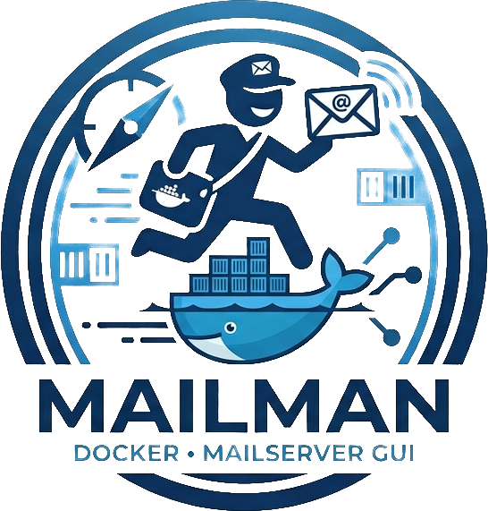

# Docker Mailserver Mailman

    

Interface to manage docker mailserver email accounts.

Not through the setup script. Tried that, too slow. Let's do LDAP!

Much like my other projects, this was built because there either wasn't a solution, or I didn't like it.

This package is intended to do the following, some of it yet to be implemented:

* Manage Email accounts & Aliases through a local LDAP server.
* Allow to connect different distributed databases to the LDAP backend
* Managing Dovecot sieve scripts

I'll be really honest here -- **you probably shouldn't expose this LDAP interface to the public net.**

LDAP is a new protocol for me; or, well it's internals are.

I might get confident enough in the future after heavy testing to remove this warning. **Today is not that day.**
